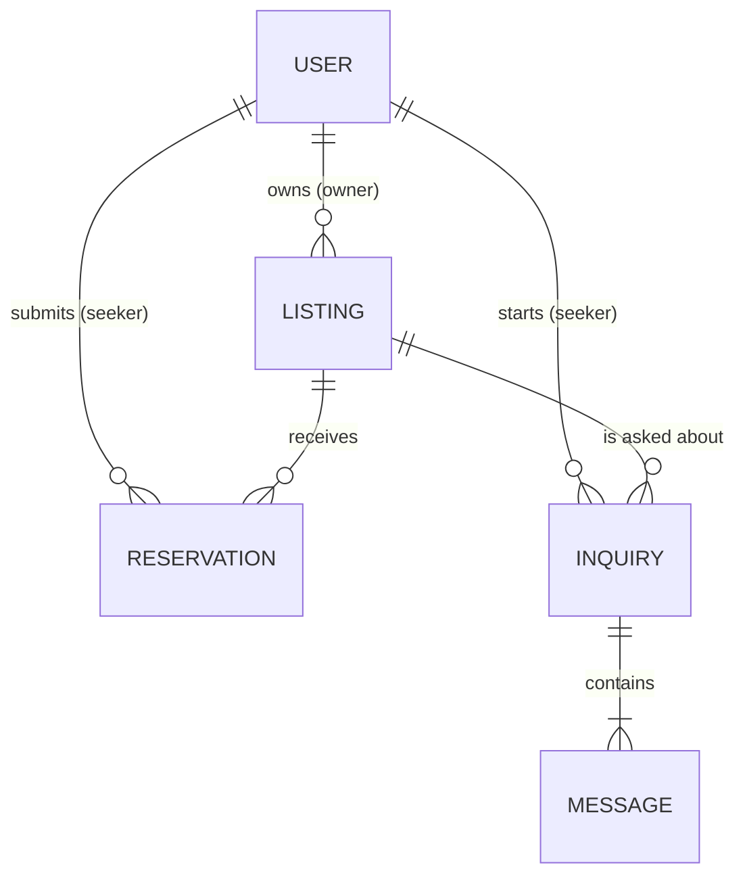

# Data model

What FINDorm stores in MongoDB. Back end: build the Mongoose schemas in `server/models/` from this. Front end: this is the shape of the data your forms send and your pages receive.

Behavior rules referenced as **D-xx** are explained in [decisions.md](decisions.md).

## Overview

Four collections:

| Collection | Model | What it holds |
|---|---|---|
| `users` | `User` | Seekers, owners, and admins |
| `listings` | `Listing` | Dormitories and boarding houses posted by owners |
| `reservations` | `Reservation` | A seeker's request for one slot in a listing |
| `inquiries` | `Inquiry` | A message thread between one seeker and a listing's owner |

Every document also gets `_id` (MongoDB ObjectId) and `createdAt` / `updatedAt` (use `{ timestamps: true }` on every schema). In API responses, ids are strings and dates are ISO 8601 strings.

## Shared value lists

Keep these in one file on the server (e.g. `server/config/constants.js`) and one on the client, so both sides use the exact same spelling.

**Roles:** `seeker`, `owner`, `admin`

**Cities** (D-01): `Caloocan`, `Las Piñas`, `Makati`, `Malabon`, `Mandaluyong`, `Manila`, `Marikina`, `Muntinlupa`, `Navotas`, `Parañaque`, `Pasay`, `Pasig`, `Pateros`, `Quezon City`, `San Juan`, `Taguig`, `Valenzuela`

**Property types** (D-02): `Dormitory`, `Boarding House`

**Gender categories:** `Male`, `Female`, `Any`

**Reservation statuses:** `Pending`, `Accepted`, `Rejected`

**Amenities:** `WiFi`, `Air Conditioning`, `Electric Fan`, `Private Bathroom`, `Shared Bathroom`, `Kitchen Access`, `Laundry Area`, `Study Area`, `CCTV`, `Security Guard`, `Water Included`, `Electricity Included`, `Parking`

The amenities list is fixed so listings are consistent and easy to compare. Add to it through a PR if owners need something that isn't there.

---

## User

| Field | Type | Required | Rules |
|---|---|:---:|---|
| `firstName` | String | ✅ | Trimmed, 1–50 characters |
| `lastName` | String | ✅ | Trimmed, 1–50 characters |
| `email` | String | ✅ | Trimmed, lowercased, valid email format, **unique** |
| `password` | String | ✅ | Stored as a bcrypt hash only (NFR-01). The plain password must be 8–72 characters (bcrypt ignores anything past 72 bytes). `select: false` so it is never returned by default |
| `role` | String | ✅ | One of the roles. `seeker` or `owner` at sign-up; `admin` only through the seed script (D-09). Cannot be changed after registration |
| `phone` | String | — | Philippine mobile format `09XXXXXXXXX` (11 digits) |
| `isActive` | Boolean | ✅ | Default `true`. `false` blocks login and all authenticated requests (D-08) |

**Never send to the client:** `password`. Also never send another user's `email` or `phone` except to an admin (NFR-04).

**Indexes:** unique on `email`.

## Listing

| Field | Type | Required | Rules |
|---|---|:---:|---|
| `owner` | ObjectId → User | ✅ | Set by the server from the logged-in owner, never from the request body |
| `name` | String | ✅ | Trimmed, 3–100 characters. The property name, e.g. "Casa Verde Dormitory" |
| `propertyType` | String | ✅ | One of the property types |
| `city` | String | ✅ | One of the cities (D-01) |
| `address` | String | ✅ | Trimmed, 5–200 characters. Street, barangay, landmarks |
| `description` | String | — | Up to 2000 characters |
| `monthlyRent` | Number | ✅ | Whole pesos, 1–100000. Price per slot per month |
| `genderCategory` | String | ✅ | One of the gender categories |
| `amenities` | [String] | — | Each must be from the amenities list, no duplicates. Default `[]` |
| `houseRules` | String | — | Up to 2000 characters. Curfew, visitors, etc. |
| `capacity` | Number | ✅ | Whole number, 1–500. Total rooms or bed slots |
| `availableSlots` | Number | ✅ | Whole number, from 0 up to `capacity` |
| `photos` | [Photo] | — | Up to 10. See below. Default `[]` |

**Photo** (embedded, from Cloudinary):

| Field | Type | Rules |
|---|---|---|
| `url` | String | Cloudinary `secure_url` — what the front end displays |
| `publicId` | String | Cloudinary `public_id` — needed to delete the image |

Uploads: JPEG, PNG, or WebP, up to 5 MB each.

**Derived, not stored:** `isFull` = `availableSlots === 0`. Include it in API responses so the front end can show "Full" (FR-16) without doing the check itself.

**Indexes:** `{ city: 1, monthlyRent: 1 }` for search, `{ owner: 1 }` for "my listings".

## Reservation

| Field | Type | Required | Rules |
|---|---|:---:|---|
| `listing` | ObjectId → Listing | ✅ | |
| `seeker` | ObjectId → User | ✅ | Set from the logged-in seeker |
| `owner` | ObjectId → User | ✅ | Copied from `listing.owner` when the request is created, so "incoming requests" is one simple query |
| `status` | String | ✅ | One of the reservation statuses. Starts as `Pending` |
| `moveInDate` | Date | — | Must be today or later when submitted |
| `message` | String | — | Up to 500 characters. A note to the owner |
| `respondedAt` | Date | — | Set when the owner accepts or rejects |

**Rules** (enforced on the server):
- One request = one slot (D-03).
- A seeker can't have more than one `Pending` or `Accepted` request for the same listing (D-03).
- New requests are refused when the listing is full (D-04).
- Only `Pending` requests can be accepted, rejected, or withdrawn. `Accepted` and `Rejected` are final (D-05, D-06).
- Accepting decreases `listing.availableSlots` by 1 and must never take it below 0, even if two accepts happen at the same moment. Do the check and the decrease in one step, e.g. `Listing.findOneAndUpdate({ _id, availableSlots: { $gt: 0 } }, { $inc: { availableSlots: -1 } })` — if it returns `null`, the listing is full.

**Indexes:** `{ seeker: 1, createdAt: -1 }`, `{ owner: 1, status: 1, createdAt: -1 }`, `{ listing: 1, seeker: 1 }`.

## Inquiry

One thread per seeker–listing pair (D-07).

| Field | Type | Required | Rules |
|---|---|:---:|---|
| `listing` | ObjectId → Listing | ✅ | |
| `seeker` | ObjectId → User | ✅ | The seeker who started the thread |
| `owner` | ObjectId → User | ✅ | Copied from `listing.owner` when the thread is created |
| `messages` | [Message] | ✅ | At least one. See below |
| `lastMessageAt` | Date | ✅ | Updated on every new message, for sorting the inbox |

**Message** (embedded):

| Field | Type | Required | Rules |
|---|---|:---:|---|
| `sender` | ObjectId → User | ✅ | Must be the thread's `seeker` or `owner` |
| `body` | String | ✅ | Trimmed, 1–1000 characters |
| `createdAt` | Date | ✅ | Set by the server |

Only the thread's seeker and owner can read or post (NFR-04). Admins do not read inquiries.

**Indexes:** unique on `{ listing: 1, seeker: 1 }`, plus `{ seeker: 1, lastMessageAt: -1 }` and `{ owner: 1, lastMessageAt: -1 }`.

---

## Deleting things

| When this is deleted | Also delete |
|---|---|
| A listing (D-11) | Its reservations and inquiries, and its photos from Cloudinary |
| A user | Nothing — users are deactivated, not deleted (D-08) |
